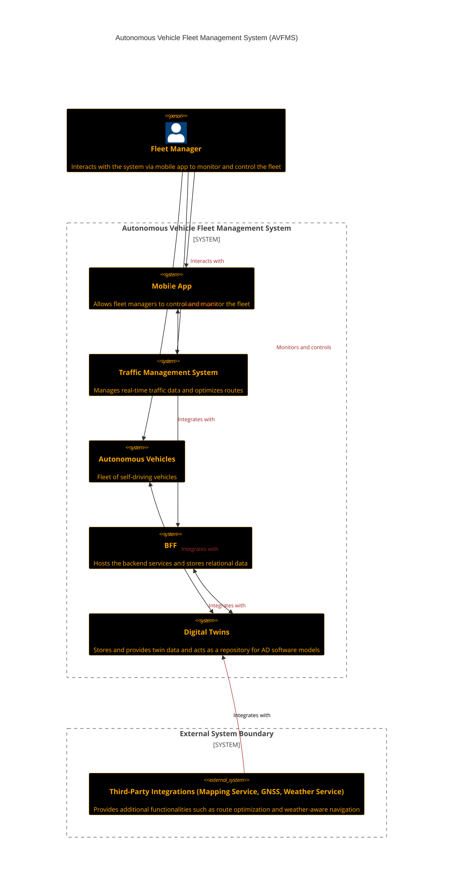
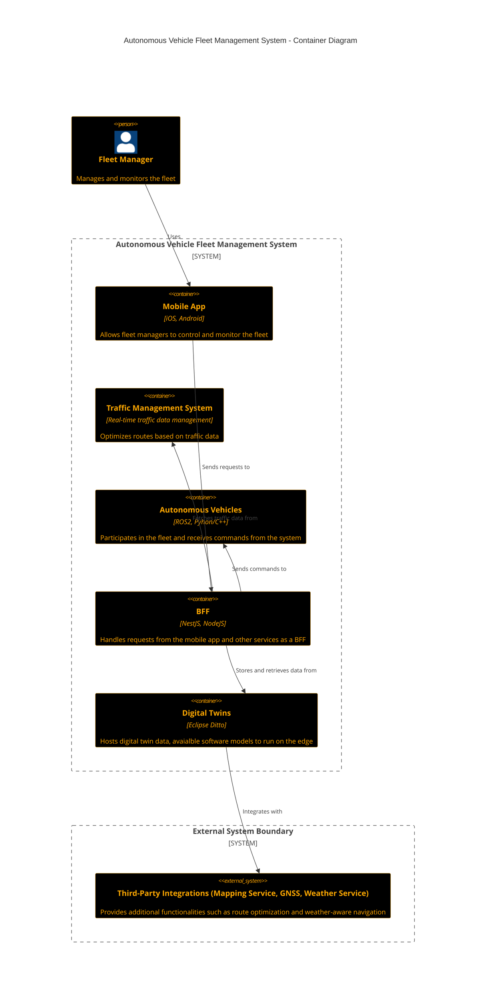

# Assignment One

## Task

- Research [c4 model](c4model.com) and exemplify each diagram type.

## Research

### C4 Model

```
1. A set of hierarchical abstractions (software systems, containers, components, and code)***
2. A set of hierarchical diagrams (system context, containers, components, and code).
3. Notation independent.
4. Tooling independent.
```

### Attributes
- Easy to learn
- Dev friendly ('they say')
- Enables communication
- Facilitates following processes (and more):
  - onboarding
  - review/eval
  - risk identification
  - threat modeling
- Standardization (unifying)
- Abstraction-first approach

### Abstractions
A `softare system` is "mapped" using following abstract terms and concepts:
- `containers`: a top-level encapsulating entity, that hosts other relatively small parts ('components')
- `component` : "...a group of related functionality, encapsulated behind a well-defined interface."
- `code`: concrecte implementation of components in a programming language (vai its constructs: classes, interfaces, functions etc...)
- there is also `people` involved btw.


## Sample Diagrams

### Level I: Context Diagram
- High-level overview of the system and its interactions with other entities (i.e. user, other systems)


# Level II: Container Diagram

